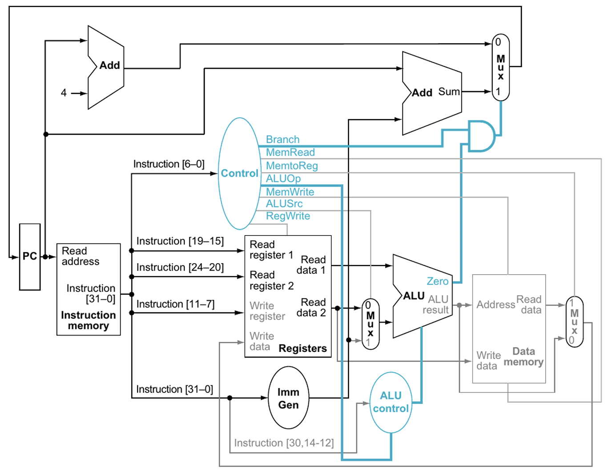
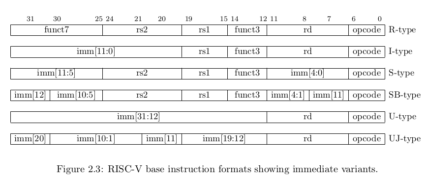

# CWRU CPU Docs

<p align="center">
    
</p>

*Credit: Patterson & Hennessy, [Computer Organization and Design: RISC-V Edition](https://www.elsevier.com/books/computer-organization-and-design-risc-v-edition/patterson/978-0-12-812275-4)*


## How It Works

This is an educational technical project aimed at teaching CWRU computer engineering students 
how to design a single-cycle RISC-V processor in Verilog. This `info.md` is meant to serve as 
pedagogical material for those also interested in learning computer architecture concepts. The
deliverable will be a complete processor that executes a Fibonacci sequence using RISC-V assembly.

---

## Pipeline (Big Picture)

The CPU has five stages that it must go through to complete a single instruction:
1. `IF` / `Instruction Fetch`: Fetches the current cycle's instruction from memory
2. `ID`/ `Instruction Decode`: Converts instructions into register addresses, opcodes, etc.
3. `EX` / `Execute`: Perform operations with those opcodes/register values 
4. `MEM` / `Memory`: Writes/loads data to memory, more important for load/store instructions
5. `WB` / `Writeback`: Writes result into the register file for next cycle, repeat

In a **single-cycle** design, all five stages happen within one clock period. Every component
is connected combinationally from the output of instruction memory through to the writeback
mux, with the only registered state being the program counter (updated on each clock edge)
and the register file / data memory (written on the clock edge when their respective write
enables are asserted).

---

## RISC-V Opcode Reference

These are the standard base integer (RV32I) opcodes. The `opcode` field occupies
bits [6:0] of every instruction.

| Instruction Type | opcode (binary) | opcode (hex) | Example Instructions               |
|------------------|-----------------|--------------|------------------------------------|
| R-type           | `0110011`       | `0x33`       | `add`, `sub`, `and`, `or`, `slt`   |
| I-type (ALU)     | `0010011`       | `0x13`       | `addi`, `andi`, `ori`, `slti`      |
| I-type (Load)    | `0000011`       | `0x03`       | `lw`, `lh`, `lb`                   |
| I-type (JALR)    | `1100111`       | `0x67`       | `jalr`                             |
| S-type           | `0100011`       | `0x23`       | `sw`, `sh`, `sb`                   |
| B-type           | `1100011`       | `0x63`       | `beq`, `bne`, `blt`, `bge`         |
| U-type (LUI)     | `0110111`       | `0x37`       | `lui`                              |
| U-type (AUIPC)   | `0010111`       | `0x17`       | `auipc`                            |
| J-type           | `1101111`       | `0x6F`       | `jal`                              |

### funct3 Reference

`funct3` (bits [14:12]) disambiguates instructions that share the same opcode.

| funct3 | R-type (`0x33`) | I-type ALU (`0x13`) | Load (`0x03`) | Store (`0x23`) | Branch (`0x63`) |
|--------|-----------------|---------------------|---------------|----------------|-----------------|
| `000`  | `add` / `sub`*  | `addi`              | `lb`          | `sb`           | `beq`           |
| `001`  | `sll`           | `slli`              | `lh`          | `sh`           | `bne`           |
| `010`  | `slt`           | `slti`              | `lw`          | —              | —               |
| `011`  | `sltu`          | `sltiu`             | —             | —              | —               |
| `100`  | `xor`           | `xori`              | `lbu`         | —              | `blt`           |
| `101`  | `srl` / `sra`*  | `srli` / `srai`*    | `lhu`         | —              | `bge`           |
| `110`  | `or`            | `ori`               | —             | `sw`           | `bltu`          |
| `111`  | `and`           | `andi`              | —             | —              | `bgeu`          |

*\* `funct7[5]` distinguishes these pairs: `0` → `add` / `srl` / `srli`, `1` → `sub` / `sra` / `srai`*

---

## Components

### Program Counter

The program counter acts as a tracker for the CPU. Namely, what instruction are we executing right now?
It is a register that holds the address of the instruction that's currently being executed. This number
can be updated based on normal sequencing (+4 bytes per cycle for 4-byte instructions) or conditional branches
and jumps that can happen in the code. The pins you'll need are:

- `clk`: program counter needs to update on the clock, keeping it synchronized with the rest of the CPU
- `pc_in`: this is a little tricky but this is the next address to execute, it may come from a branch 
- `pc_out`: this is the current address being executed, and `pc_in` will propagate on the next edge

Essentially, the program counter is just a large 32-bit flip-flop if that helps the Verilog code. 
As for the lack of reset pins for this program counter, it's cleaner to have a separate register
in the top module that's sensitive to the reset and propagate it into the program counter, as opposed
to having reset here and needing to reset the `pc` signal in the top module anyway.

### Instruction Memory

Instruction memory is a piece of RAM that stores your instructions for the processor to execute. It may
be more intuitive to think of an instruction memory as an array:

```C
// this array would be your instruction memory
unsigned char instructions[256] ={0x00000013, 0x00000013, 0x00000013, ...};
// to access the array, you need to do some indexing
// normal cpu operation

// we have a register named curr_instr
unsigned char curr_instr;

// we use a for loop here, the counter variable
// i is just like our program counter
for (int i = 0; i < 256; i++) {
    curr_instr = instructions[i];
}
```

For those who are technically sharp, this isn't 100% accurate because of possible branch/jump instructions,
but for 99% of cases when the CPU is running sequentially, this is a perfect parallel. The pins you'll need are:

- `pc`: the output of your program counter (incrementer)
- `instr`: whatever instruction needs to be executed

Hint: to instantiate an array block in Verilog, you can do this:

```Verilog
    wire [WIDTH-1:0] mem [0:DEPTH-1];
```
- Just remember if you're updating it in a process, use `reg` instead
- `mem` is just the assigned name, you can name it anything
- `WIDTH` is how wide each word is, maybe let's say 32 bits wide
- `DEPTH` is how many words can be stored at a given time in `mem`

You can pre-load instruction memory using `$readmemh` in a Verilog initial block, which reads a hex file
of encoded instructions directly into your memory array:

```verilog
initial begin
    $readmemh("program.hex", mem);
end
```

### Register File

The `register file` is a module that, in RISC-V specification, contains 32 distinct registers. Each register itself can store a 32-bit word, which can then be used as operands within the ALU. Some design questions:

- Does the register file need a `clk` signal? What are the advantages/tradeoffs of having a clocked register file?
- We will need read and write ports for the register file. 
For 32 registers, how many bits do we need to identify a unique
register? We will need three addresses: `rd_addr1`, `rd_addr2`, and `wr_addr`.

> **Important**: In RISC-V, register `x0` is hardwired to zero — writes to it must be ignored and
> reads from it must always return `0`. Make sure your register file enforces this.

### Immediate Generator

The immediate generator, like its name suggests, generates an immediate value. But what is an immediate value? Take a look at the following assembly instruction:

```txt
add x3, x1, x2
```

In RISC-V, there are six types of instructions: R-type, I-type, S-type, B-type, U-type, and J-type instructions. This `add` instruction is an R-type instruction, as it adds the contents of two registers (namely `x1 ` and `x2`) and saves the result in `x3`. There is no immediate here. Now let's take a look at an I-type instruction:

```txt
addi x3, x1, 1
```

With a blank register file that will initiate all register values to 0 on power up, you would be pretty limited in what you can do with just zeroes. This "add immediate" instruction allows you to add any integer with x1, and save the result to x3. 

<p align="center">
    
</p>

*Source: RISC-V International, The RISC-V Instruction Set Manual, Volume I: User-Level ISA, Version 2.2.*

Refer to this diagram to see how the immediates are encoded in each instruction. You can determine based on the opcodes what type of instruction it is. As for designing/writing the RTL code, treat the immediate generator as a switch case that based on the opcode, decodes the immediate value from the instruction. For simplicity, make the immediate a 32-bit logic value to keep things consistent.

All immediates must be **sign-extended** to 32 bits. This means replicating the most significant bit
of the immediate field across all upper bits when producing the 32-bit output. In Verilog:

```verilog
// Example: sign-extending a 12-bit I-type immediate
assign imm_out = {{20{instr[31]}}, instr[31:20]};
```

### Control Unit

The control unit asserts flags that help facilitate the `execute` stage of the CPU. Generally, it needs to take in the opcode, funct3, and funct7 as inputs, and it outputs the following values:

- `RegWrite`: are we writing the result to reg?
- `MemRead`: are we reading from memory?
- `MemWrite`: are we writing to memory?
- `BranchEq`: is the `beq` condition satisfied?
- `MemToReg`: are we loading from memory to reg?
- `ALUSrc`: which operand are we using? (`0` = rs2, `1` = immediate)
- `ALUCont`: what type of ALU operation are we doing? (passed to ALU control)
- `JMP`: did a jump occur?

This can be implemented using a really large switch case. Recall that we have 6 types of instructions (R, I, S, B, U, J) all with different opcodes and funct codes.

The table below summarizes what each control signal should be asserted to for each major instruction type:

| Signal      | R-type | I-type (ALU) | I-type (Load) | S-type | B-type | J-type |
|-------------|--------|--------------|---------------|--------|--------|--------|
| `RegWrite`  | 1      | 1            | 1             | 0      | 0      | 1      |
| `ALUSrc`    | 0      | 1            | 1             | 1      | 0      | —      |
| `MemRead`   | 0      | 0            | 1             | 0      | 0      | 0      |
| `MemWrite`  | 0      | 0            | 0             | 1      | 0      | 0      |
| `MemToReg`  | 0      | 0            | 1             | —      | —      | 0      |
| `BranchEq`  | 0      | 0            | 0             | 0      | 1      | 0      |
| `JMP`       | 0      | 0            | 0             | 0      | 0      | 1      |

#### R-type

R-type (R for register) instructions are one of the common types of instructions that you will encounter in the assembly language. R-type operations always take two values from the register file, perform an operation (addition, subtraction, multiplication, division), then writes directly back to the register file.

#### I-type

I-type instructions are also extremely common but slightly different from R-type instructions, where the I-part stands for "immediate". The I-type instruction typically takes only one register and a user-defined constant (0-4095) as operands, making it useful for easy increments without having to explicitly reference a second register operand. Load instructions (`lw`, `lh`, `lb`) are also encoded as I-type: the immediate serves as a byte offset added to `rs1` by the ALU to compute the memory address.

#### S-type

S-type (store) instructions write a register value into data memory. The destination address is computed
as `rs1 + imm`, where the 12-bit immediate is split across two non-contiguous fields in the instruction
encoding — bits [11:5] in `instr[31:25]` and bits [4:0] in `instr[11:7]`. Your immediate generator must
reassemble these pieces. Common S-type instructions: `sw` (store word), `sh` (store halfword), `sb` (store byte).

#### B-type

B-type (branch) instructions conditionally redirect the program counter based on a comparison between two
registers. The branch target is PC-relative: `PC + imm`, where `imm` is a signed 13-bit offset (always
even, since instructions are 4-byte aligned). The immediate is also scrambled across the instruction word —
refer to the encoding diagram above carefully. The ALU computes `rs1 - rs2` and the `zero_flag` tells
the control unit whether the branch condition is satisfied. Common B-type instructions: `beq`, `bne`, `blt`, `bge`.

#### U-type

U-type (upper immediate) instructions load a 20-bit immediate into the upper 20 bits of a destination
register (bits [31:12]), zeroing the lower 12 bits. This is useful for constructing large constants in
combination with an I-type instruction. For example, `lui x1, 0x12345` followed by `addi x1, x1, 0x678`
builds the full 32-bit constant `0x12345678` in `x1`. The two U-type instructions are `lui`
(Load Upper Immediate) and `auipc` (Add Upper Immediate to PC, useful for position-independent addressing).

#### J-type

J-type (jump) instructions unconditionally redirect the program counter. Like B-type, the target is
PC-relative, but the immediate is 21 bits, allowing larger jumps. The return address (`PC + 4`) is saved
into `rd`, enabling function calls and returns. The immediate bits are scrambled across the instruction
word — be careful to reassemble them correctly in your immediate generator. The primary J-type instruction
is `jal` (Jump and Link). Its register-indirect cousin, `jalr` (Jump and Link Register), is actually
encoded as an I-type with opcode `0x67`.

### Arithmetic Logic Unit

The arithmetic logic unit (also known as the ALU) is the calculator that performs mathematical
operations on your operands. The ALU accepts the following pins:

- `op1`: your first operand (always `rs1` from the register file)
- `op2`: second operand — either `rs2` (R-type) or the sign-extended immediate (I/S/B-type),
  selected by the `ALUSrc` control signal upstream
- `alu_ctrl`: the specific operation to perform (add, sub, AND, OR, SLT, etc.)
- `res`: the 32-bit result of the operation
- `zero_flag`: asserted when `res == 0`; used by the control unit to evaluate branch conditions

The `alu_ctrl` lines are typically driven by a small sub-module called the **ALU Control Unit**,
which takes `ALUCont` (from the main control unit) plus `funct3` and `funct7` to determine
the exact operation. For example, both `add` and `sub` share the R-type opcode `0x33` — it is
`funct7[5]` that distinguishes them.

| `alu_ctrl` | Operation           | Used by                         |
|------------|---------------------|---------------------------------|
| `0000`     | AND                 | `and`, `andi`                   |
| `0001`     | OR                  | `or`, `ori`                     |
| `0010`     | ADD                 | `add`, `addi`, `lw`, `sw`       |
| `0110`     | SUB                 | `sub`, `beq` (zero check)       |
| `0111`     | Set Less Than (SLT) | `slt`, `slti`                   |
| `1100`     | NOR                 | (less common)                   |
| `1101`     | XOR                 | `xor`, `xori`                   |
| `1110`     | Shift Left Logical  | `sll`, `slli`                   |
| `1111`     | Shift Right Logical | `srl`, `srli`                   |

> Note: the `alu_ctrl` encoding above is one common convention — what matters is internal consistency
> between your ALU and ALU control unit.

A minimal Verilog skeleton for the ALU:

```verilog
module alu (
    input  [31:0] op1,
    input  [31:0] op2,
    input  [3:0]  alu_ctrl,
    output reg [31:0] res,
    output zero_flag
);
    always @(*) begin
        case (alu_ctrl)
            4'b0000: res = op1 & op2;          // AND
            4'b0001: res = op1 | op2;          // OR
            4'b0010: res = op1 + op2;          // ADD
            4'b0110: res = op1 - op2;          // SUB
            4'b0111: res = (op1 < op2) ? 1 : 0; // SLT
            4'b1101: res = op1 ^ op2;          // XOR
            4'b1110: res = op1 << op2[4:0];    // SLL
            4'b1111: res = op1 >> op2[4:0];    // SRL
            default: res = 32'b0;
        endcase
    end
    assign zero_flag = (res == 32'b0);
endmodule
```

### Data Memory

The data memory acts as a secondary RAM that stores runtime data (not instructions). Specifically,
`STORE` instructions write data from the register file into data memory, and `LOAD` instructions
read data back from memory into the register file.

The pins you'll need are:

- `clk`: data memory writes are synchronous — they happen on the clock edge
- `addr`: the memory address to read from or write to (comes from the ALU result)
- `wr_data`: the data to be written (comes from `rs2` in the register file)
- `MemRead`: control signal asserted for load instructions (`lw`)
- `MemWrite`: control signal asserted for store instructions (`sw`)
- `rd_data`: the data read out of memory (routed to the writeback mux)

A few design notes:

- **Address alignment**: RISC-V word addresses are 4-byte aligned. The ALU computes the full
  byte address, so index into your word-addressed memory array using `addr[N:2]` (dropping the
  two LSBs).
- **Read vs. Write**: Writes must be clocked (registered) so data is only committed on the
  clock edge. Reads can be combinational in a single-cycle design so the data is available
  immediately within the same cycle.
- **MemToReg mux**: The `MemToReg` control signal selects whether the writeback value into
  the register file comes from the ALU result (`MemToReg = 0`) or from `rd_data` (`MemToReg = 1`).
  This 2:1 mux lives between data memory and the register file write port, typically in your
  top-level datapath.

```verilog
module data_memory (
    input         clk,
    input  [31:0] addr,
    input  [31:0] wr_data,
    input         MemRead,
    input         MemWrite,
    output [31:0] rd_data
);
    reg [31:0] mem [0:255];  // 256 words of data memory

    always @(posedge clk) begin
        if (MemWrite)
            mem[addr[9:2]] <= wr_data;  // word-aligned write
    end

    assign rd_data = MemRead ? mem[addr[9:2]] : 32'b0;
endmodule
```

---

## Top-Level Datapath

With all components implemented, the top-level module wires them together. The signal flow
for a typical R-type instruction looks like this:

```
PC → Instruction Memory → [opcode/rs1/rs2/rd/funct3/funct7]
                              ↓              ↓
                        Control Unit    Register File (read rs1, rs2)
                              ↓              ↓
                         ALUSrc mux ← rs2 or Immediate Generator
                              ↓
                             ALU → res → MemToReg mux → Register File (write rd)
                                          ↑
                                     Data Memory (if Load)
```

For branch instructions, the ALU `zero_flag` is AND-ed with `BranchEq` to decide whether
`pc_in` comes from `PC + 4` (sequential) or `PC + imm` (branch taken). For jump instructions,
`pc_in` is driven directly to `PC + imm` when `JMP` is asserted.

---

## Target Program: Fibonacci Sequence

The goal of this project is to execute the following Fibonacci sequence program in RISC-V
assembly. Use this as your integration test — if your CPU correctly drives the seven-segment
display through all Fibonacci values, all five pipeline stages and all major instruction types
are working.

```asm
# Fibonacci sequence in RISC-V assembly
# x1 = F(n-2), x2 = F(n-1), x3 = F(n), x10 = loop counter

    addi x1, x0, 0       # F(0) = 0
    addi x2, x0, 1       # F(1) = 1
    addi x10, x0, 10     # compute 10 terms

loop:
    add  x3, x1, x2      # F(n) = F(n-1) + F(n-2)
    add  x1, x0, x2      # x1 = old x2
    add  x2, x0, x3      # x2 = new F(n)
    sw   x3, 0(x0)       # store result to data memory (addr 0)
    addi x10, x10, -1    # decrement counter
    bne  x10, x0, loop   # if counter != 0, loop
```

This program exercises `addi` (I-type), `add` (R-type), `sw` (S-type), and `bne` (B-type) —
a solid cross-section of the instruction set that validates your control unit, ALU, register
file, data memory, and branch logic all at once.

---

## How to Test

### Simulation (Icarus Verilog or Vivado XSim)

1. Pre-load instruction memory using `$readmemh("fibonacci.hex", mem)` in an `initial` block
   inside your instruction memory module.
2. Write a testbench that instantiates your top-level CPU, drives `clk`, and asserts reset for
   the first few cycles.
3. Use `$monitor` or `$dumpvars` to observe register file contents and data memory writes over time.
4. Verify that after 10 loop iterations, the sequence `0, 1, 1, 2, 3, 5, 8, 13, 21, 34` appears
   at memory address 0 across successive cycles.

### On Hardware (Seven-Segment Display)

The CPU will drive a seven-segment display showing each Fibonacci value in sequence. Confirm that
the display cycles through the correct values without freezing or producing garbage output. Common
failure modes to watch for:

- Display stuck on one value → branch logic not redirecting the PC correctly
- Display shows wrong values → ALU or immediate generator bug
- Display cycles too fast / too slow → clock domain issue at the top level

---

## External Hardware

There's no external hardware needed to run this ASIC! It will run a Fibonacci sequence on the
seven-segment display using the assembly instructions above.

---

## References

- Patterson & Hennessy, *Computer Organization and Design: RISC-V Edition*, Elsevier
- RISC-V International, *The RISC-V Instruction Set Manual, Volume I: User-Level ISA, Version 2.2*